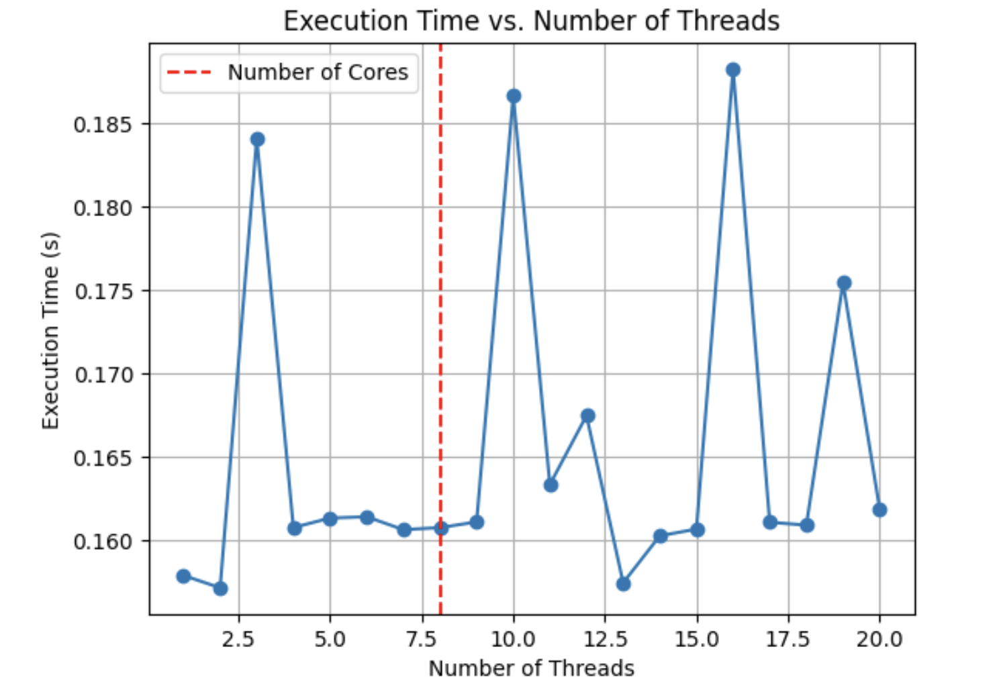
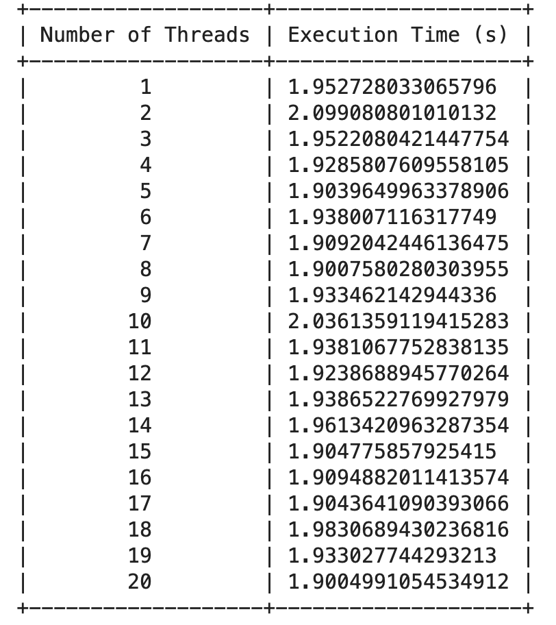

# Matrix Multiplication with Multithreading

This project demonstrates the implementation of efficient matrix multiplication using multithreading in Python. It includes a `matrix_multiply` function that performs the matrix multiplication and a `perform_matrix_multiplication` function that runs the multiplication with varying numbers of threads and measures the execution times.

## Features

- Parallel matrix multiplication using multithreading
- Execution time analysis for different number of threads
- Visualization of results using a line plot and a table

## Usage

1. Run the provided code to generate a plot of the execution time vs. the number of threads, and a table of the execution times.
2. The plot will be saved as `plot4.png`, and the table will be displayed as an image.

## Functions

### `matrix_multiply(matrix1, matrix2)`

Performs the matrix multiplication of the two input matrices.

- **Input**:
  - `matrix1`: A 2D list representing the first matrix
  - `matrix2`: A 2D list representing the second matrix
- **Output**: A 2D list representing the result of the matrix multiplication

### `perform_matrix_multiplication(M, num_matrices=100)`

Runs the matrix multiplication with varying numbers of threads and measures the execution times.

- **Input**:
  - `M`: A 2D list representing the first matrix to be multiplied
  - `num_matrices` (optional): The number of random matrices to be multiplied with `M` (default is 100) in this case its 30
- **Output**: A list of execution times for different numbers of threads

## Results

The results of the matrix multiplication with varying numbers of threads are displayed in the following plot and table:

The plot and table show the relationship between the number of threads and the execution time for the matrix multiplication task. As the number of threads increases, the execution time decreases, up to a certain point where the performance gains start to diminish.

## Dependencies

- Python 3.x
- `matplotlib` library for plotting
- `tabulate` library for creating the execution time table

## License

This project is licensed under the [MIT License](LICENSE).
